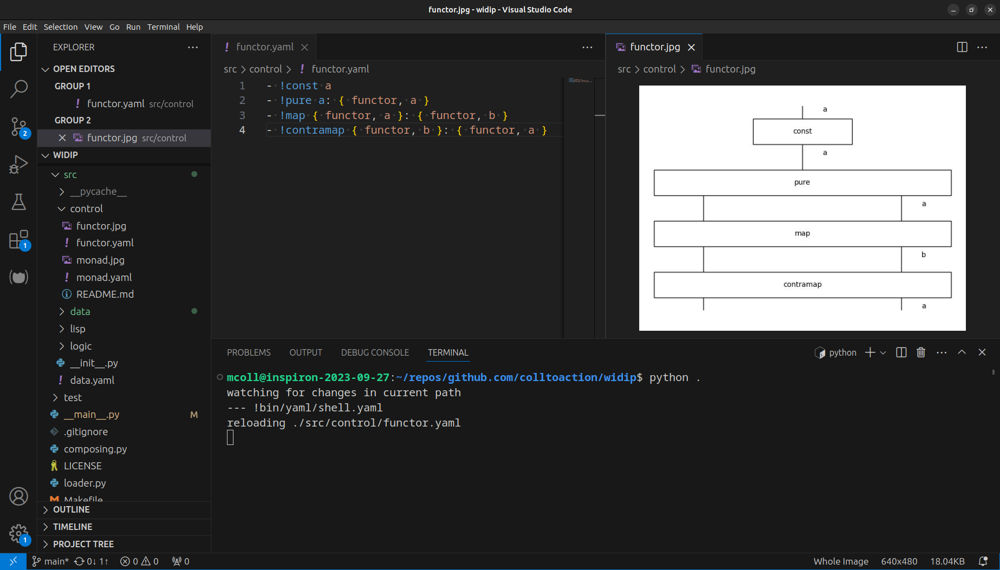
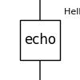

Widip
-----

Widip is an [interactive environment] for computing with wiring diagrams in modern systems.



The widi data structure models the full range of YAML documents giving each document a visual representation. The UNIX ecosystem provides immediate benefits being standard from developer workstations to production servers. A text-based approach makes a productive developer environment with minimal dependencies.

# Installation

`widip` can be installed via [pip](https://pypi.org/project/widip/) and run from the command line as follows:

```bash
pip install widip
python -m widip
```

This will automatically install dependencies: [discopy](https://pypi.org/project/discopy/) (computing, drawing), [pyyaml](https://pypi.org/project/pyyaml/) (parser library), and [watchdog](https://pypi.org/project/watchdog/) (filesystem watcher).

## Local install

If you're working with a local copy of this repository, run `pip install -e .`.

# Using Widip
Users have two modes of interaction:
* the [filesystem]
* a [chatbot] or [command-line interface]

## Filesystem
1. While running, `.jpg`s will be reloaded on file changes
2. Open `.yaml` and `.jpg` files side by side for a fast feedback loop

Diagrams are written as `.yaml` documents and are meant for human authors. Widip watches the filesystem for any changes to source and immediately renders updated images to keep pace with graphical reasoning.

Using this lightweight [UNIX shell] users can use their own tools for editing text and viewing images. As an example, VS Code will automatically reload `README.md`s and `.jpg` tabs when files change.

## Command-line interface

Open terminal and run `widip` to start an interactive session. The program `bin/yaml/shell.yaml` prompts for one command per line, so when we hit `↵ Enter` it is evaluated. When hitting `⌁ Ctrl+D` the environment exits.

```yaml
--- !bin/yaml/shell.yaml
!print Hello world!
Hello world!
```

<!--  -->

# Computing

Programming is hard, but it shouldn't be _that_ hard. Many long-standing systems have thrived thanks to a uniform metaphor, and in our case will be widis.

System|Metaphor
------|--------
Widip|Wiring Diagram
UNIX|File
Lisp|List
Smalltalk|Object

So far widis have mainly shaped the user interface. Widis are also [graphical programming](https://graphicallinearalgebra.net/2015/04/26/adding-part-1-and-mr-fibonacci/) tools and one can work with them in purely mathematical terms, but one can also take a practical approach. All processes reading and writing YAML are effectively diagram rewriters, and the system doesn't mandate in any way how how that happens.

This means that we are not limited but empowered by the formal transformations in the mathematician toolbox. It is natural to want to extend the system in terms of diagrams just like in the mentioned systems, and this leads to current work in a functional library at [src](src).

[UNIX shell]: https://en.wikipedia.org/wiki/Unix_shell
[chatbot]: https://en.wikipedia.org/wiki/chatbot
[command-line interface]: https://en.wikipedia.org/wiki/Command-line_interface
[filesystem]: https://en.wikipedia.org/wiki/File_manager
[interactive environment]: https://en.wikipedia.org/wiki/Read%E2%80%93eval%E2%80%93print_loop
