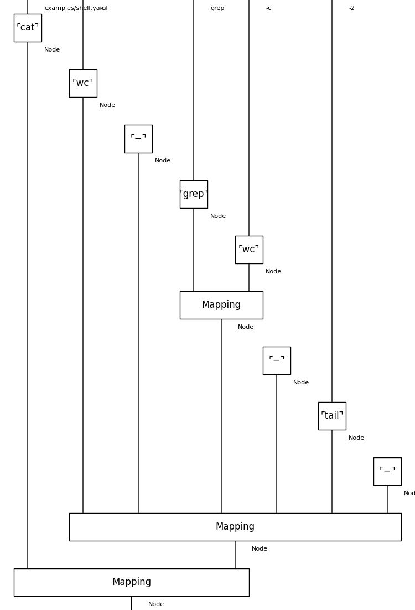
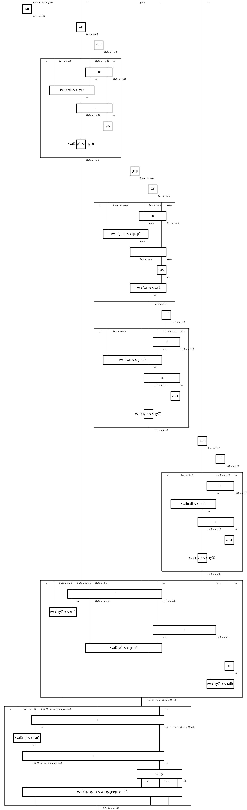
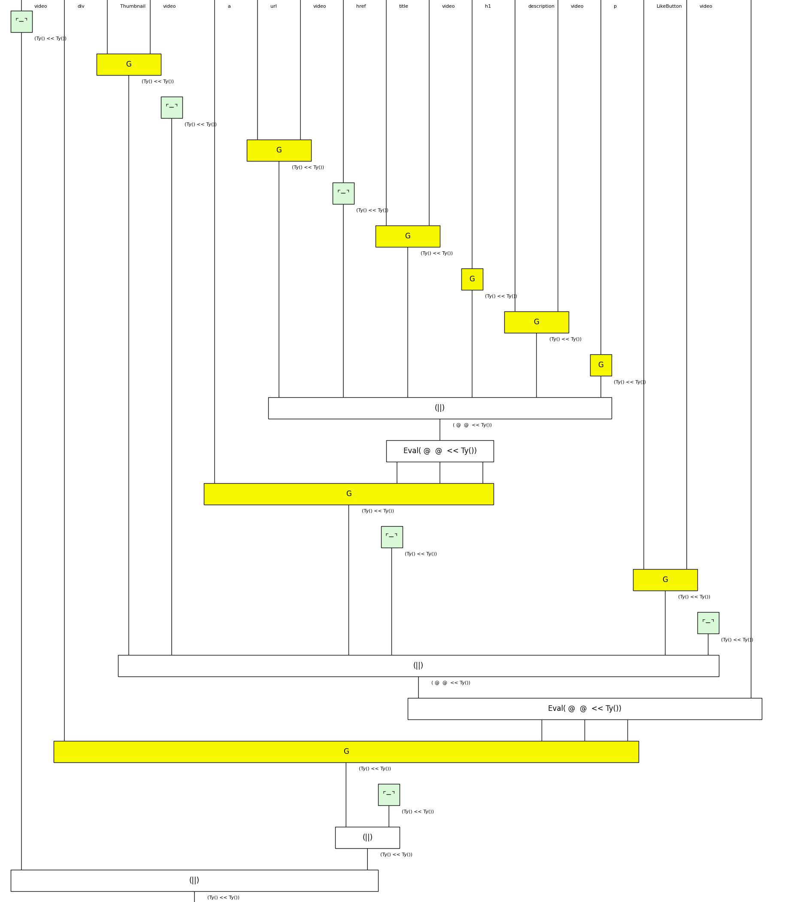
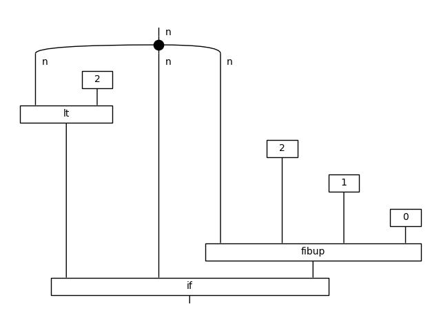

# Shell examples

## Hello world!

```
$ python -m widip examples/hello-world.yaml
Hello world!
```


## Script

```
$ python -m widip examples/shell.yaml
73
23
  ? !grep grep: !wc -c
  ? !tail -2
```






# Working with the CLI
Open terminal and run `widip` to start an interactive session. The program `bin/yaml/shell.yaml` prompts for one command per line, so when we hit `↵ Enter` it is evaluated. When hitting `⌁ Ctrl+D` the environment exits.

```yaml
--- !bin/yaml/shell.yaml
!echo Hello world!
Hello world!
```

# Other examples

## React
The first example in https://react.dev/ in diagrammatic style.



## Sweet expressions
`fibfast` function from https://wiki.c2.com/?SweetExpressions.



## Rosetta code

* https://rosettacode.org
* [rosetta](rosetta) examples directory
