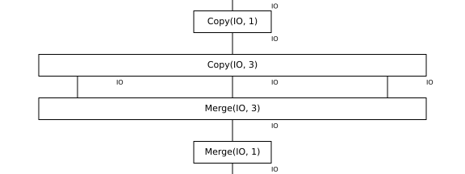
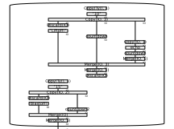

# Shell Examples

## Hello World

A simple example that outputs a string.

```bash
python -m widip examples/hello-world.yaml
# Expected: Hello world!
```


## Script

Demonstrates parallel fan-out with a mapping. Reads its own source file and computes multiple statistics.

```bash
python -m widip examples/shell.yaml
# Expected: byte count, grep matches, and last 2 lines
```



## Countdown

Recursive countdown orchestration using `test` for termination, `expr` for arithmetic, and anchor/alias for recursion.

```bash
echo "5" | python -m widip examples/countdown.yaml
# Expected: 5 4 3 2 1 Liftoff!
```



---

## Working with the CLI

Open terminal and run `widip` to start an interactive session:

```yaml
--- !bin/yaml/shell.yaml
!echo Hello world!
Hello world!
```

---

## Other Examples

### Rosetta Code
Standard programming tasks from [rosettacode.org](https://rosettacode.org):
- [rosetta/](rosetta/) - FizzBuzz, Factorial, Fibonacci, etc.

### Advent of Code 2025
Solutions for [AoC 2025](https://adventofcode.com/2025):
- [aoc2025/](aoc2025/) - Days 1-3 implemented as shell pipelines
