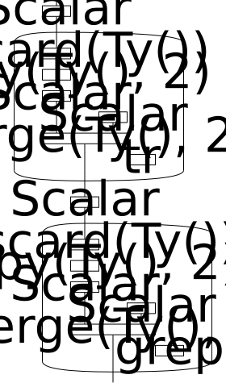
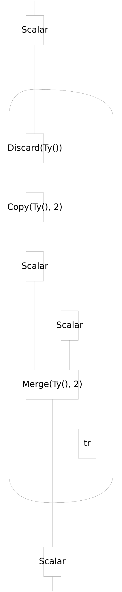
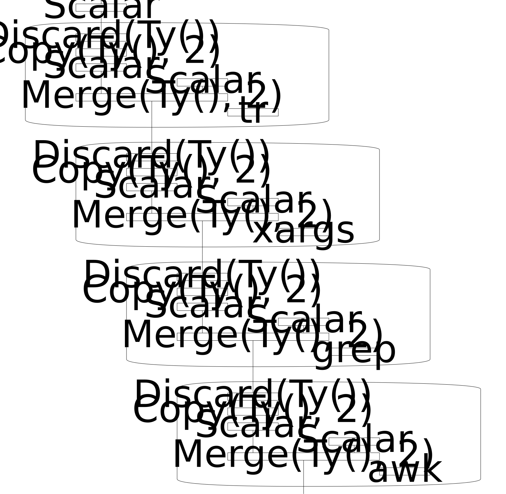
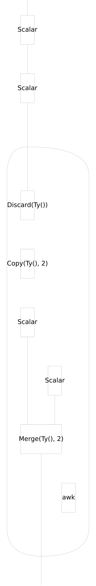

# Advent of Code 2025

## Day 1-1

```
$ python -m widip examples/aoc2025/1-1.yaml
1147
```



## Day 1-2

```
$ python -m widip examples/aoc2025/1-2.yaml
6789
```



## Day 2-1

```
$ python -m widip examples/aoc2025/2-1.yaml
13108371860
```



## Day 2-2

```
$ python -m widip examples/aoc2025/2-2.yaml
22471660255
```


## Day 3-1

```
$ python -m widip examples/aoc2025/3-1.yaml
17324
```

