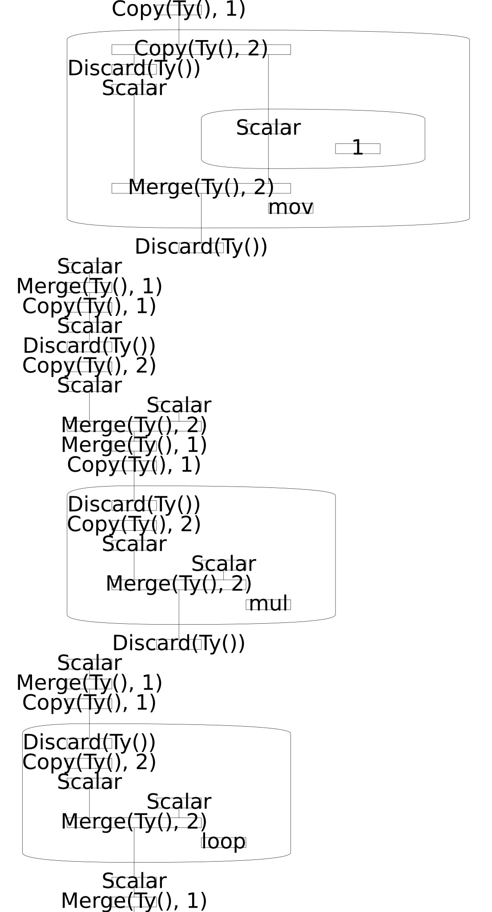
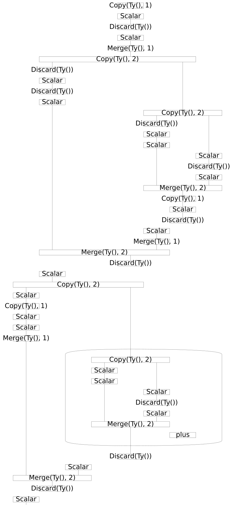

# Rosetta Code Examples

Examples from [rosettacode.org](https://rosettacode.org) implemented in widip.

## FizzBuzz

Classic FizzBuzz using standard Unix tools (`xargs`, `printf`, `bc`, `test`, `tee`).

```bash
python -m widip examples/rosetta/FizzBuzz.yaml | head -16
# Expected:
# 1
# 2
# Fizz
# 4
# Buzz
# Fizz
# 7
# 8
# Fizz
# Buzz
# 11
# Fizz
# 13
# 14
# FizzBuzz
# 16
```


## Factorial (x86 Assembly)

Pseudocode representation of x86 factorial from [Rosetta Code](https://rosettacode.org/wiki/Factorial#x86_Assembly).

Uses boxes to represent assembly instructions. Note:
- `label` gets its own box like `loop`
- Implicit `eax` parameters show data flow between `mov`, `mul`, and `loop`



## Fibonacci

Recursive Fibonacci structure demonstration.



## Repeat a String

Simple string repetition using Python eval.

```bash
echo "ha" | python -m widip examples/rosetta/repeat-a-string.yaml
# Expected: hahahahaha
```
