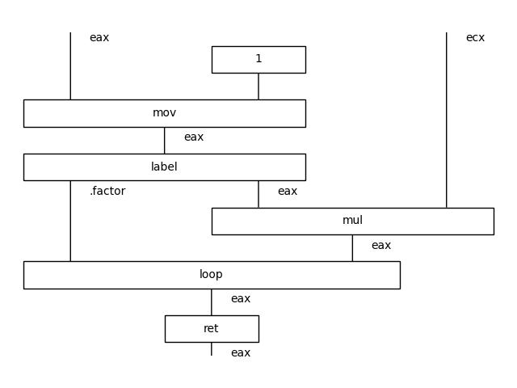

# Rosetta code examples

## FizzBuzz
Rosetta Code FizzBuzz implemented with standard Unix tools. Demonstrates conditional logic and nested orchestration via `xargs` and `expr`.

```
$ python -m widip examples/rosetta/FizzBuzz.yaml | head -n 16
1
2
Fizz
4
Buzz
...
```


## Factorial x86 assembly
https://rosettacode.org/wiki/Factorial#x86_Assembly

In this example we use boxes to represent assembly code. Note:
1. `label` gets its own box just like `loop`
1. implicit `eax` parameters are added to show the relation between `mov`, `mul` and `loop` instructions


