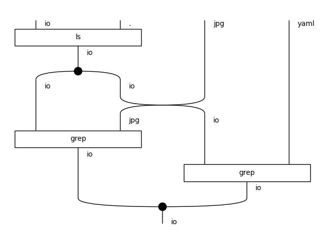

# UNIX Shell

A shell example that uses ls and grep to demonstrate:

1. copying ls output
1. piping to parallel grep processes
1. joining parallel grep outputs

The expected output is
```
shell.jpg
shell.yaml
```



## Future work

The diagam io parameters should be abstracted so that one can write

```yaml
!ls .:
  ? !grep jpg
  ? !grep yaml
