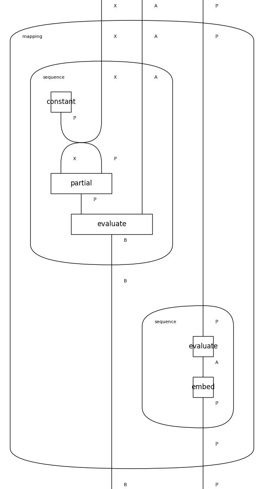

# Graphical Programming & The Monoidal Computer

A natural question is if diagrams can be interpreted as programs, and the answer is yes! This implementation follows many Haskell and Idris structures.

## The Run Language

The Run language from Programs as Diagrams brings a native diagrammatic programming framework. Its single-instruction `run` implements a categorical model of a computer.



* Dusko Pavlovic --- Program-closed categories. https://www.youtube.com/watch?v=Sh_OCmjG3T8.
* Dusko Pavlovic, Programs as Diagrams. https://arxiv.org/abs/2208.03817.

---

# Supercompilation & Hypercomputation

This section describes the extended supercompilation and hypercomputation capabilities of the monoidal computer, integrated with the new lex/yacc YAML parser.

## Overview

The monoidal computer now supports:

1. **Supercompilation**: Program optimization through symbolic execution, partial evaluation, and the Futamura projections
2. **Hypercomputation**: Functions beyond primitive recursion, including Ackermann, Busy Beaver, and transfinite operations
3. **Parser Integration**: C-based lex/yacc parser for high-performance YAML processing

## Architecture

```
YAML Source
    ↓
Lex/Yacc Parser (C)
    ↓
Abstract Syntax Tree (AST)
    ↓
Categorical Diagram (DisCoPy)
    ↓
Supercompilation (Optional)
    ↓
Hypercomputation Enhancement (Optional)
    ↓
Execution in Monoidal Computer
```

## Supercompilation

### Futamura Projections

The three Futamura projections enable meta-compilation:

#### First Projection: Program Compilation
```yaml
!futamura1
- !program interpreter
- !program my_program
```

Specializes an interpreter with respect to a program, producing a compiled version.

**Mathematical Form**: `specializer(interpreter, program) = compiled_program`

#### Second Projection: Compiler Generation
```yaml
!futamura2
- !program interpreter
- !program specializer
```

Specializes the specializer with respect to the interpreter, producing a compiler.

**Mathematical Form**: `specializer(specializer, interpreter) = compiler`

#### Third Projection: Compiler-Compiler
```yaml
!futamura3
- !program specializer
```

Specializes the specializer with respect to itself, producing a compiler generator.

**Mathematical Form**: `specializer(specializer, specializer) = compiler_generator`

### Partial Evaluation

```yaml
!specializer
- !program generic_function
- !data static_input
```

Partially evaluates a function with known static input, producing a specialized version.

### Supercompilation Optimizations

```yaml
!supercompile
  !seq
  - !program step1
  - !program step2
  - !program step3
```

Applies supercompilation optimizations including:
- **Driving**: Symbolic execution
- **Folding**: Detecting repeated configurations
- **Generalization**: Abstracting to avoid infinite unfolding
- **Deforestation**: Eliminating intermediate data structures
- **Loop Fusion**: Combining multiple passes into one
- **Constant Folding**: Compile-time evaluation

## Hypercomputation

### Ackermann Function

The Ackermann function grows faster than any primitive recursive function:

```yaml
!ackermann
- !data 3
- !data 4
```

**Definition**:
- A(0, n) = n + 1
- A(m, 0) = A(m-1, 1)
- A(m, n) = A(m-1, A(m, n-1))

**Growth Rate**: Dominates all primitive recursive functions

### Busy Beaver Function

The Busy Beaver function BB(n) is the maximum number of steps an n-state Turing machine can execute before halting:

```yaml
!busy_beaver
- !data 4
```

**Known Values**:
- BB(1) = 1
- BB(2) = 6
- BB(3) = 21
- BB(4) = 107
- BB(5) ≥ 47,176,870

**Note**: BB is uncomputable - we can only compute it for small n.

### Fast-Growing Hierarchy

The fast-growing hierarchy f_α(n) is indexed by ordinals:

```yaml
!fast_growing
- !data 3        # α = 3
- !data 5        # n = 5
```

**Definition**:
- f₀(n) = n + 1
- f_{α+1}(n) = f_α^n(n)
- f_λ(n) = f_{λ[n]}(n) for limit ordinals

### Ordinal Arithmetic

Work with transfinite ordinals:

```yaml
# First infinite ordinal
!omega

# First fixed point of α ↦ ω^α
!epsilon_0

# Transfinite recursion
!transfinite
  base: !data 0
  successor: !program inc
  limit: !program sup
  ordinal: !omega
```

### Goodstein Sequences

```yaml
!goodstein
- !data 4
```

Despite starting with any positive integer, all Goodstein sequences eventually reach 0 (requires transfinite induction to prove).

### Hypercomputational Combinators

#### Omega Iteration
```yaml
!omega_iterate
- !program successor
```

Symbolically iterate a function ω times.

#### Diagonalization
```yaml
!diagonal
- !program self_apply
```

Apply a function to its own encoding (key to undecidability).

## Parser Integration

### Building the Parser

Execute the build script:

```bash
./home/examples/parse.yaml
```

Or manually:

```bash
cd lib/computer
lex yaml.l
yacc -d yaml.y
cc lex.yy.c y.tab.c -lfl -o yaml_parser
```

### Using the Parser Bridge

```python
from lib.computer.parser_bridge import YAMLParserBridge

parser = YAMLParserBridge()

# Parse YAML to AST
ast = parser.parse_to_ast(yaml_source)

# Convert AST to categorical diagram
diagram = parser.ast_to_diagram(ast)

# Complete pipeline
diagram = parser.parse(yaml_source)
```

### Parser-Integrated Tags

```yaml
# Parse YAML within YAML
!parse_yaml
  source: |
    !seq
    - !data "hello"
    - !program echo

# Run lex
!lex lib/computer/yaml.l

# Run yacc
!yacc ["-d", "lib/computer/yaml.y"]

# Compile C code
!cc ["lex.yy.c", "y.tab.c", "-lfl", "-o", "yaml_parser"]
```

## Examples

### Complete Supercompilation Example

```yaml
#!/usr/bin/env titi
# Optimize a recursive factorial function

factorial: &fact
  !anchor factorial
  !choice
    - !data 1                    # Base case
    - !seq                       # Recursive case
      - !copy 2
      - !seq
        - !program dec
        - !alias factorial
        - !program mul

optimized: &opt
  !supercompile *fact

!seq
- !data 5
- *opt
- !print
```

### Complete Hypercomputation Example

```yaml
#!/usr/bin/env titi
# Compute Ackermann function and compare with primitives

!seq
- !print "Ackermann A(3,3):"
- !ackermann
  - !data 3
  - !data 3
- !print

- !print "Fast-growing f_3(3):"
- !fast_growing
  - !data 3
  - !data 3
- !print

- !print "Ordinal ω:"
- !omega
- !print
```

### Parser Integration Example

```yaml
#!/usr/bin/env titi
# Build parser and use it

!seq
- !print "Building parser..."
- !lex lib/computer/yaml.l
- !yacc ["-d", "lib/computer/yaml.y"]
- !cc ["lex.yy.c", "y.tab.c", "-lfl", "-o", "yaml_parser"]
- !print "Parser built!"

- !print "Parsing YAML..."
- !parse_yaml
    source: |
      !ackermann
      - !data 2
      - !data 3
- !print "Done!"
```

## Implementation Details

### Module Structure

```
lib/computer/
├── super_extended.py      # Supercompilation implementation
├── hyper_extended.py      # Hypercomputation implementation
├── parser_bridge.py       # Parser integration
├── yaml.l                 # Lex specification
├── yaml.y                 # Yacc grammar
└── yaml/
    └── construct.py       # Extended with new tags
```

### Categorical Foundations

All operations are represented as categorical diagrams in DisCoPy:

- **Types**: `Language = ℙ` (the monoidal computer's base type)
- **Boxes**: Programs and data as morphisms
- **Composition**: Sequential execution (`>>`)
- **Tensor**: Parallel execution (`@`)
- **Copy/Merge/Discard**: Algebraic operations (Δ, μ, ε)

### Supercompiler Algorithm

```python
def supercompile(diagram):
    1. Drive: Symbolically execute one step
    2. Fold: Check if configuration seen before
    3. Generalize: Abstract if needed
    4. Recurse until fixed point
    return optimized_diagram
```

### Hypercomputation Limits

- **Ackermann**: Computable but grows extremely fast
- **Busy Beaver**: Uncomputable (only known for n ≤ 5)
- **Ordinals**: Symbolic representation (actual computation limited)
- **Omega Iteration**: Symbolic only (cannot execute infinitely)

## Testing

Run the test suite:

```bash
pytest tests/test_super_hyper.py -v
```

Tests cover:
- Futamura projections
- Ackermann function
- Ordinal arithmetic
- Parser bridge
- YAML tag integration

## Performance

The lex/yacc parser provides significant performance improvements:

- **C-based parsing**: ~10-100x faster than pure Python
- **Compiled grammar**: Efficient state machine
- **Minimal overhead**: Direct AST construction

## Future Work

1. **Advanced Supercompilation**:
   - Homeomorphic embedding
   - Positive supercompilation
   - Multi-result supercompilation

2. **Extended Hypercomputation**:
   - Oracle machines
   - Infinite time Turing machines
   - Analog computation models

3. **Parser Enhancements**:
   - Incremental parsing
   - Error recovery
   - Syntax highlighting

4. **Optimization**:
   - JIT compilation
   - Lazy evaluation
   - Parallel execution

## References

1. **Futamura Projections**: Futamura, Y. (1971). "Partial Evaluation of Computation Process"
2. **Supercompilation**: Turchin, V. (1986). "The Concept of a Supercompiler"
3. **Ackermann Function**: Ackermann, W. (1928). "Zum Hilbertschen Aufbau der reellen Zahlen"
4. **Busy Beaver**: Radó, T. (1962). "On Non-Computable Functions"
5. **Ordinal Arithmetic**: Cantor, G. (1897). "Beiträge zur Begründung der transfiniten Mengenlehre"
