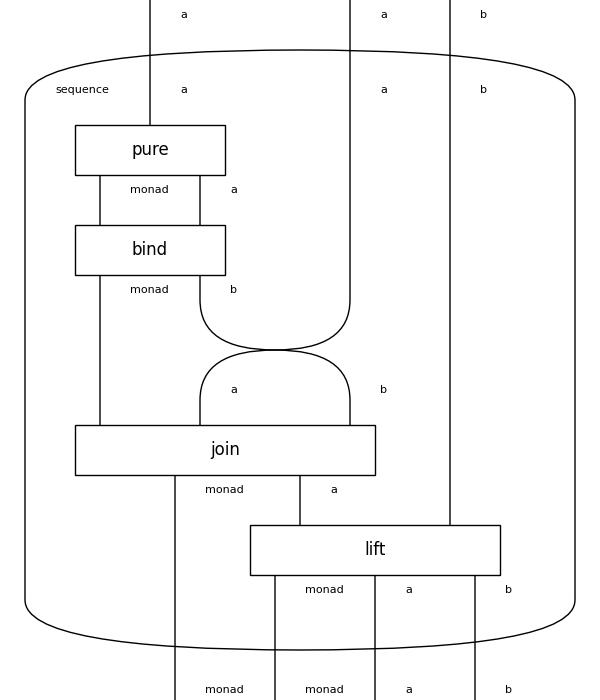

# Control

`control` diagrams implement structures for control flow such as `functor`s and `monad`s.

## Category
Check Functorial Semantics for Partial Theories:
* https://dl.acm.org/doi/pdf/10.1145/3434338
* https://www.youtube.com/watch?v=PncjL_EP22g

## Monad
Monads extend `functor`s and `applicative`s with a `bind` box.

