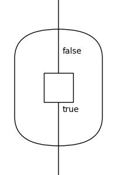
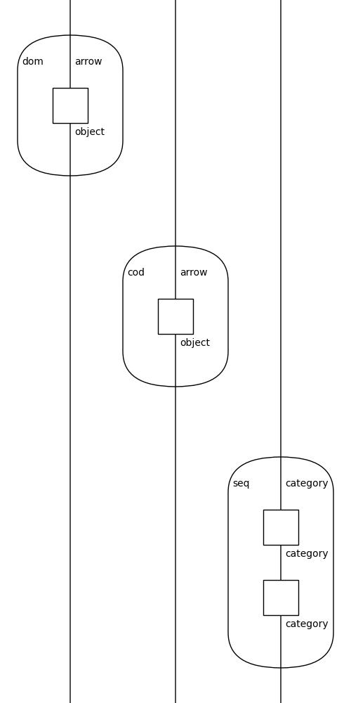
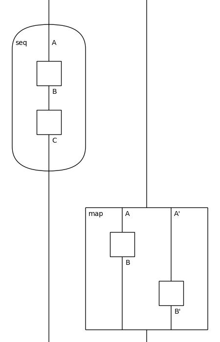

# Category
These diagrams generate categories such as `bool`, `monoidal`, and `category` itself.

## Bool
See: https://hackage.haskell.org/package/data-category-0.11/docs/Data-Category-Boolean.html.

## Category

## Monoidal
See Example 4.2: https://arxiv.org/abs/2101.12046

