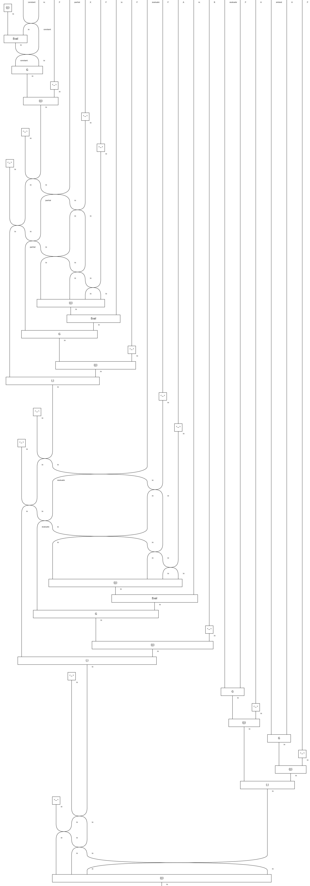

# Graphical programming
A natural question is if diagrams can be interpreted as programs, and the answer is yes! This implement follows many Haskell and Idris structures.

## The Run language
The Run language from Programs as Diagrams brings a native diagrammatic programming framework. Its single-instruction `run` implements a categorical model of a computer.

* Dusko Pavlovic --- Program-closed categories. https://www.youtube.com/watch?v=Sh_OCmjG3T8.
* Dusko Pavlovic, Programs as Diagrams. https://arxiv.org/abs/2208.03817.
