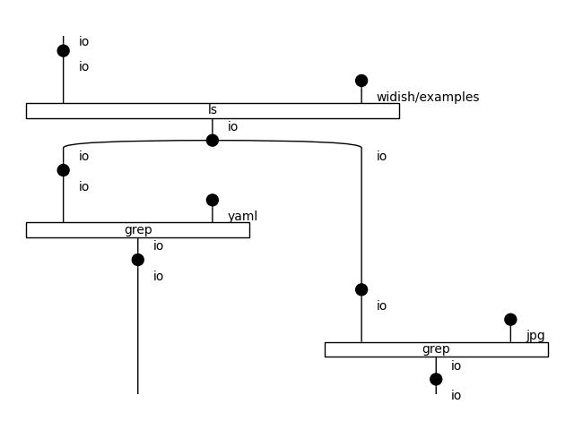

# UNIX Shell

A shell example that uses ls and grep to demonstrate:

1. copying ls output
1. piping to parallel grep processes
1. joining parallel grep outputs in their original order (`.yaml` before `.jpg`)

The expected output is
```
$ python -m widish shell.yaml
shell.yaml
shell.jpg
```


